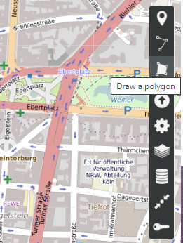
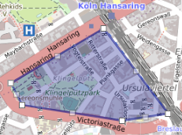
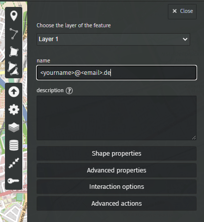
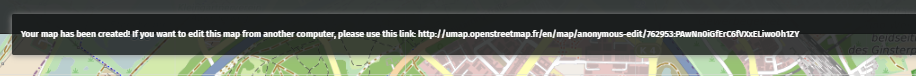
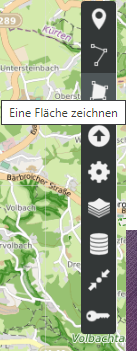
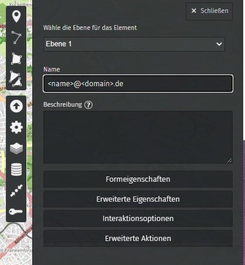

# How to share your commonly frequented biking areas
[English](https://github.com/Studentenfutter/OBS_Koeln/README.md#English)
[Deutsch](https://github.com/Studentenfutter/OBS_Koeln/README.md#Deutsch)

# English
1. Open the Website https://umap.openstreetmap.fr/en/map/new/#13/50.9381/6.9782 (if prompted click "Create a map")
2. Click on the Button **"Draw a polygon"** in the top right corner.

3. Create points to mark an area that you often frequent by bike. Make sure to include the streets on the border of the selected area in your drawing. Click **the first point you created** again to finish the area selection.

    
4. A window will appear on the right side. Please enter your email adress where we can contact you in the name field.

   
5. Click close and the **"Draw a polygon"** button to add all areas that you frequent very often (**at least one time per week**). Ensure to add them to the same **Layer 1** as the other areas.
6. Once you marked all areas, click **Save** in the top right corner.

   
   7. A small notification will apear on the top. Please copy the URL shown there (Double click on the text in case you cant select it) and send us the Link along with the following info to cologne@correlaid.org

    Name:
    Age:
    How often do you use your bike: Daily / almost daily / 5 days a week / 2-3 days a week / Once per week / Every two weeks / Every month
    In which district in Cologne do you live*:
    What type of bike will you use to collect data: Citybike / Cargo-Bike / E-Bike / Pedelec / Tandem / ...
    Contact Email*:

   Fields with a * are required
   
# Deutsch
1. Öffnen Sie die Website https://umap.openstreetmap.fr/de/map/new/#13/50.9381/6.9782 (wenn Sie dazu aufgefordert werden, klicken Sie auf "Eine Karte erstellen")
2. Klicken Sie auf die Schaltfläche **"Eine Fläche zeichnen "** in der oberen rechten Ecke.
   

3. Erstellen Sie mehrere Punkte, um ein Gebiet zu markieren, das Sie häufig mit dem Fahrrad befahren. Achten Sie darauf, dass Sie die Straßen am Rande des ausgewählten Gebiets in Ihre Zeichnung aufnehmen. Klicken Sie erneut auf **den ersten erstellten Punkt**, um die Auswahl des Bereichs abzuschließen.

4. Auf der rechten Seite erscheint ein Fenster. Bitte geben Sie in das Namensfeld Ihre E-Mail-Adresse ein, unter der wir Sie erreichen können.

5. Klicken Sie auf **"Schließen"** und auf die Schaltfläche "**Eine Fläche zeichnen"**, um alle Bereiche hinzuzufügen, die Sie sehr häufig aufsuchen (**mindestens einmal pro Woche**). Achten Sie darauf, dass Sie sie auf derselben **Ebene 1** wie die anderen Bereiche hinzufügen.
6. Wenn Sie alle Bereiche markiert haben, klicken Sie auf **Speichern** in der oberen rechten Ecke. 

7. Eine kleine Benachrichtigung wird oben angezeigt. Bitte kopieren Sie die dort angezeigte URL (Doppelklick auf den Text, falls Sie ihn nicht auswählen können) und senden Sie uns den Link zusammen mit den folgenden Informationen an cologne@correlaid.org
 
 

   
    Name:
    Alter:
    Wie oft benutzt du dein Fahrrad? Täglich / fast täglich / 5 Tage die Woche / 2-3 Tage die Woche / einmal pro Woche / alle zwei Wochen / jeden Monat
    In welchem Stadtteil von Köln wohnen Sie*:
    Welchen Fahrradtyp nutzen Sie für die Datenerhebung? Citybike / Cargo-Bike / E-Bike / Pedelec / Tandem / ...
    Kontakt E-Mail*:

   Felder mit einem * sind Pflichtfelder

